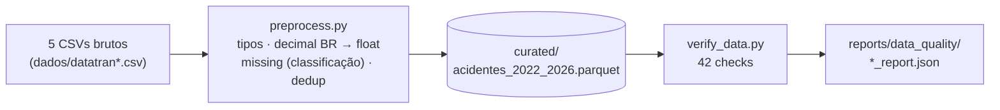

# Etapa 2 — Pré-processamento e Verificação dos Dados

**Projeto:** Predição de Risco de Acidentes em Rodovias Federais (base PRF)
**Scripts:** [`src/preprocess.py`](../../src/preprocess.py) · [`src/verify_data.py`](../../src/verify_data.py)
**Evidências:** [`docs/evidencias/`](../evidencias/) · [`reports/data_quality/`](../../reports/data_quality/)
**Data de execução:** 2026-08-26

> Todos os números abaixo vêm da execução real dos scripts sobre `dados/datatran2022.csv`…`datatran2026.csv`.

---

## 1. Objetivo

Transformar os 5 CSVs brutos da PRF (formatação numérica inconsistente, tipos instáveis entre anos) em uma camada curada única (`dados/curated/acidentes_2022_2026.parquet`), tipada e validada, pronta para EDA e engenharia de atributos.

## 2. Dados

| Arquivo | Registros |
|---|---:|
| 2022 / 2023 / 2024 / 2025 / 2026 | 64.606 / 67.766 / 73.156 / 72.529 / 33.694 |
| **Total** | **311.751 linhas, 30 colunas** |

30 colunas: identificação (`id`), temporais (`data_inversa`, `horario`, `dia_semana`), localização (`uf`, `br`, `km`, `latitude`, `longitude`, `municipio`), circunstância (`causa_acidente`, `tipo_acidente`, `condicao_metereologica`, `tipo_pista`, `tracado_via`, `sentido_via`, `uso_solo`, `fase_dia`), gravidade (`classificacao_acidente`, `mortos`, `feridos_leves`, `feridos_graves`, `ilesos`, `ignorados`, `feridos`, `pessoas`, `veiculos`) e administrativas (`regional`, `delegacia`, `uop`).

## 3. Principais problemas encontrados (diagnóstico do bruto)

- `km`, `latitude`, `longitude`: texto com vírgula decimal (100% das linhas).
- `id`: tipo inconsistente entre arquivos anuais; 1 registro com notação científica (`"6e+05"` em `datatran2024.csv`).
- Ausentes: `classificacao_acidente` (5 linhas, 0,002%); `regional`/`delegacia`/`uop` (~1%, concentrados em 2026, ano parcial).
- Inconsistência de origem: 16.817 linhas (5,39%) com `pessoas` ≠ soma de `mortos+feridos_leves+feridos_graves+ilesos+ignorados`.
- Duplicidade (por `id` ou linha inteira): **0 casos**. Encoding/mojibake: **0 casos**. Coordenadas fora do Brasil: **0 casos**.

## 4. Tratamentos aplicados (`preprocess.py`)

| Tratamento | Ação | Justificativa curta |
|---|---|---|
| Decimal BR → float | `,`→`.` + `to_numeric(coerce)` em km/lat/lon | Necessário para uso numérico; 0 valores perdidos |
| Tipos | `id`→`Int64`, métricas→`Int64`, `data_inversa`→`datetime64` | `to_numeric` já resolve a notação científica sem tratamento manual |
| `classificacao_acidente` ausente | Inferido por `mortos`/`feridos_leves`/`feridos_graves` | Regra validada: reproduz 100% dos valores nos 311.746 registros não-nulos |
| `regional`/`delegacia`/`uop` ausentes | **Mantidos como nulo** (não imputados) | Sem regra determinística disponível; imputar fabricaria dado administrativo inexistente |
| `pessoas` ≠ soma | **Não corrigido**, apenas logado/reportado | Não há como saber qual campo está errado sem inventar valor |
| Duplicidade | `drop_duplicates(id)` + checagem de linha inteira | Salvaguarda defensiva (0 removidos nesta carga) |
| Outliers (IQR: km, pessoas, mortos, feridos_*, veiculos) | **Não removidos**, apenas diagnosticados | Ver seção 5 |

## 5. Outliers: mantidos, não removidos

Método IQR aplicado a 6 variáveis numéricas. A maior parte dos "outliers" (ex.: `mortos=1`, `feridos_graves>0`) é estatisticamente extrema só porque a mediana é 0 — não são erros, são exatamente os acidentes **graves** que o projeto quer prever. Removê-los destruiria o fenômeno estudado. `km` extremos (até 1.470) são plausíveis em rodovias longas. Nenhum valor foi removido ou transformado nesta etapa.

## 6. Validação (`verify_data.py`)

**42 checks automatizados** (schema, dtypes, duplicidade, nulos críticos, intervalos geográficos/temporais, categorias válidas, consistência entre colunas) → **status `PASSOU`** (41 OK, 1 aviso documentado: a divergência `pessoas`/soma da seção 3, que não bloqueia o pipeline).

## 7. Antes × Depois

| Métrica | Antes | Depois |
|---|---:|---:|
| Registros / Colunas | 311.751 / 30 | 311.751 / 30 |
| Tamanho em disco | 87 MB (CSV) | 10,4 MB (Parquet, −88%) |
| `km`/lat/lon como texto | 100% | 0% |
| `classificacao_acidente` ausente | 5 | 0 |
| `regional`/`delegacia`/`uop` ausentes | ~1% | ~1% (mantido, ver seção 4) |
| Duplicados / outliers removidos | 0 / 0 | 0 / 0 |
| % acidentes fatais | 7,19% | 7,19% (fenômeno preservado) |

## 8. Como reproduzir

```bash
pip install -r requirements.txt
python3 src/preprocess.py     # gera dados/curated/acidentes_2022_2026.parquet
python3 src/verify_data.py    # valida e gera reports/data_quality/verify_report.json
```

Sem seeds/aleatoriedade — pipeline 100% determinístico.

## 9. Pipeline



## 10. Conclusão

Dados brutos já eram de boa qualidade (sem duplicidade, sem erro de encoding, coordenadas válidas). Os problemas reais eram de **formato/tipo** (vírgula decimal, notação científica, tipo instável de `id`) e **ausência pontual** (~1% administrativo + 5 registros de gravidade). Todos tratados ou documentados; nenhum registro removido; a distribuição de gravidade (variável de interesse do projeto) permanece intacta. Camada curada aprovada nos 42 checks e pronta para a EDA.
