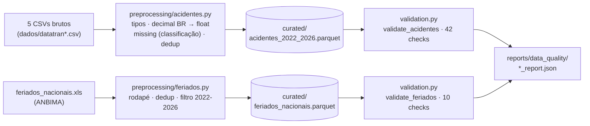

# Etapa 1 — Pré-processamento e Verificação dos Dados

**Projeto:** Predição de Risco de Acidentes em Rodovias Federais (base PRF + feriados ANBIMA)
**Scripts:** [`src/preprocessing/acidentes.py`](../../src/preprocessing/acidentes.py) · [`src/preprocessing/feriados.py`](../../src/preprocessing/feriados.py) · [`src/preprocessing/validation.py`](../../src/preprocessing/validation.py) · [`src/pipeline.py`](../../src/pipeline.py)
**Evidências:** [`docs/evidencias/`](../evidencias/) · [`reports/data_quality/`](../../reports/data_quality/)
**Data de execução:** 2026-08-26 (acidentes) · 2026-08-31 (feriados + refatoração do pipeline)

> Todos os números abaixo vêm da execução real dos scripts sobre `dados/datatran2022.csv`…`datatran2026.csv` e `dados/feriados_nacionais.xls`.

---

## 1. Objetivo

Transformar os 5 CSVs brutos da PRF (formatação numérica inconsistente, tipos instáveis entre anos) e a planilha de feriados nacionais da ANBIMA em duas camadas curadas (`dados/curated/acidentes_2022_2026.parquet` e `dados/curated/feriados_nacionais.parquet`), tipadas e validadas, prontas para EDA e engenharia de atributos.

Este documento cobre as duas bases. A base de acidentes é a fonte principal do projeto; a de feriados é complementar, usada exclusivamente para derivar features temporais (ex.: indicar se um acidente ocorreu em dia de feriado nacional) — ver `docs/spec.md`, seção 2.

---

## Parte A — Acidentes (PRF)

### A.1 Dados

| Arquivo | Registros |
|---|---:|
| 2022 / 2023 / 2024 / 2025 / 2026 | 64.606 / 67.766 / 73.156 / 72.529 / 33.694 |
| **Total** | **311.751 linhas, 30 colunas** |

30 colunas: identificação (`id`), temporais (`data_inversa`, `horario`, `dia_semana`), localização (`uf`, `br`, `km`, `latitude`, `longitude`, `municipio`), circunstância (`causa_acidente`, `tipo_acidente`, `condicao_metereologica`, `tipo_pista`, `tracado_via`, `sentido_via`, `uso_solo`, `fase_dia`), gravidade (`classificacao_acidente`, `mortos`, `feridos_leves`, `feridos_graves`, `ilesos`, `ignorados`, `feridos`, `pessoas`, `veiculos`) e administrativas (`regional`, `delegacia`, `uop`).

### A.2 Principais problemas encontrados (diagnóstico do bruto)

- `km`, `latitude`, `longitude`: texto com vírgula decimal (100% das linhas).
- `id`: tipo inconsistente entre arquivos anuais; 1 registro com notação científica (`"6e+05"` em `datatran2024.csv`).
- Ausentes: `classificacao_acidente` (5 linhas, 0,002%); `regional`/`delegacia`/`uop` (~1%, concentrados em 2026, ano parcial).
- Inconsistência de origem: 16.817 linhas (5,39%) com `pessoas` ≠ soma de `mortos+feridos_leves+feridos_graves+ilesos+ignorados`.
- Duplicidade (por `id` ou linha inteira): **0 casos**. Encoding/mojibake: **0 casos**. Coordenadas fora do Brasil: **0 casos**.

### A.3 Tratamentos aplicados (`preprocessing/acidentes.py`)

| Tratamento | Ação | Justificativa curta |
|---|---|---|
| Decimal BR → float | `,`→`.` + `to_numeric(coerce)` em km/lat/lon | Necessário para uso numérico; 0 valores perdidos |
| Tipos | `id`→`Int64`, métricas→`Int64`, `data_inversa`→`datetime64` | `to_numeric` já resolve a notação científica sem tratamento manual |
| `classificacao_acidente` ausente | Inferido por `mortos`/`feridos_leves`/`feridos_graves` | Regra validada: reproduz 100% dos valores nos 311.746 registros não-nulos |
| `regional`/`delegacia`/`uop` ausentes | **Mantidos como nulo** (não imputados) | Sem regra determinística disponível; imputar fabricaria dado administrativo inexistente |
| `pessoas` ≠ soma | **Não corrigido**, apenas logado/reportado | Não há como saber qual campo está errado sem inventar valor |
| Duplicidade | `drop_duplicates(id)` + checagem de linha inteira | Salvaguarda defensiva (0 removidos nesta carga) |
| Outliers (IQR: km, pessoas, mortos, feridos_*, veiculos) | **Não removidos**, apenas diagnosticados | Ver seção A.4 |

### A.4 Outliers: mantidos, não removidos

Método IQR aplicado a 6 variáveis numéricas. A maior parte dos "outliers" (ex.: `mortos=1`, `feridos_graves>0`) é estatisticamente extrema só porque a mediana é 0 — não são erros, são exatamente os acidentes **graves** que o projeto quer prever. Removê-los destruiria o fenômeno estudado. `km` extremos (até 1.470) são plausíveis em rodovias longas. Nenhum valor foi removido ou transformado nesta etapa.

### A.5 Validação (`preprocessing/validation.py::validate_acidentes`)

**42 checks automatizados** (schema, dtypes, duplicidade, nulos críticos, intervalos geográficos/temporais, categorias válidas, consistência entre colunas) → **status `PASSOU`** (41 OK, 1 aviso documentado: a divergência `pessoas`/soma da seção A.2, que não bloqueia o pipeline).

### A.6 Antes × Depois

| Métrica | Antes | Depois |
|---|---:|---:|
| Registros / Colunas | 311.751 / 30 | 311.751 / 30 |
| Tamanho em disco | 87 MB (CSV) | 10,4 MB (Parquet, −88%) |
| `km`/lat/lon como texto | 100% | 0% |
| `classificacao_acidente` ausente | 5 | 0 |
| `regional`/`delegacia`/`uop` ausentes | ~1% | ~1% (mantido, ver A.3) |
| Duplicados / outliers removidos | 0 / 0 | 0 / 0 |
| % acidentes fatais | 7,19% | 7,19% (fenômeno preservado) |

---

## Parte B — Feriados nacionais (ANBIMA)

### B.1 Dados

Planilha `.xls` legada, aba `Feriados`, cobrindo o histórico completo de feriados nacionais mantido pela ANBIMA: **1.273 linhas brutas** (2001–2099, incluindo linhas de rodapé com notas explicativas), 3 colunas (`Data`, `Dia da Semana`, `Feriado`).

### B.2 Principais problemas encontrados (diagnóstico do bruto)

- Rodapé de notas explicativas: 9 linhas de texto livre (ex.: `"Fonte: ANBIMA"`, notas numeradas sobre pontos facultativos) misturadas na mesma coluna `Data`, sem conter uma data válida.
- Período fora do escopo do projeto: a planilha cobre 2001–2099, mas o projeto usa apenas dados de acidentes de 2022–2026 (`docs/spec.md`, seção 7).
- 1 coincidência legítima de datas: `2079-04-21` aparece duas vezes, uma para "Paixão de Cristo" (data móvel) e outra para "Tiradentes" (data fixa) — não é duplicidade de erro, são dois feriados distintos na mesma data.
- Nulos, duplicidade de linha inteira e divergência `dia_semana` vs. `data` calculada: **0 casos**.

### B.3 Tratamentos aplicados (`preprocessing/feriados.py`)

| Tratamento | Ação | Justificativa curta |
|---|---|---|
| Renomeação de colunas | `Data`→`data`, `Dia da Semana`→`dia_semana`, `Feriado`→`feriado` | Padroniza para snake_case, consistente com `acidentes.py` |
| Remoção do rodapé | Linhas onde `data` não converte para datetime são descartadas (9 linhas) | Cada linha descartada foi inspecionada e confirmada como nota, não feriado incompleto |
| Tipos | `data`→`datetime64` | Necessário para cruzamento por data com os acidentes |
| Deduplicação | `drop_duplicates(subset=['data', 'feriado'])`, não só por `data` | Preserva o caso legítimo de 2 feriados na mesma data (seção B.2) |
| Filtro de período | Mantidos apenas registros com `data.year` em `[2022, 2026]` | Fora desse período não há acidentes correspondentes; reduz ruído na camada curada sem perder informação usada pelo projeto |
| `dia_semana` vs. calculado | **Não corrigido**, apenas diagnosticado (0 divergências observadas) | Nenhuma correção necessária nesta carga |

### B.4 Validação (`preprocessing/validation.py::validate_feriados`)

**10 checks automatizados** (schema, dtype, duplicidade por `(data, feriado)`, nulos críticos, categorias de dia da semana, período dentro de `[2022, 2026]`, consistência dia_semana × data) → **status `PASSOU`** (9 OK, 1 aviso não-bloqueante: consistência `dia_semana` vs. calculado, 0 divergências nesta carga).

### B.5 Antes × Depois

| Métrica | Antes (bruto) | Depois (curado) |
|---|---:|---:|
| Linhas / Colunas | 1.273 / 3 | 63 / 3 |
| Linhas de rodapé (notas) | 9 | 0 |
| Período coberto | 2001–2099 | 2022–2026 |
| Nulos | 0 | 0 |
| Duplicidade `(data, feriado)` | 0 | 0 |

63 linhas curadas ≈ 12–13 feriados nacionais/ano × 5 anos (2022–2026), consistente com o esperado.

---

## 2. Como reproduzir

```bash
pip install -r requirements.txt
python3 -m src.pipeline       # roda pré-processamento + validação das duas bases
# ou, isoladamente:
python3 -m src.preprocessing.acidentes    # gera dados/curated/acidentes_2022_2026.parquet
python3 -m src.preprocessing.feriados     # gera dados/curated/feriados_nacionais.parquet
python3 -m src.preprocessing.validation   # valida e gera reports/data_quality/verify_*_report.json
```

`python3 src/pipeline.py` (script direto, sem `-m`) também funciona. Cada execução do pipeline grava evidência dos logs em `docs/evidencias/preprocess_run.log` e `docs/evidencias/verify_run.log`.

Sem seeds/aleatoriedade — pipeline 100% determinístico.

## 3. Pipeline



## 4. Conclusão

**Acidentes:** dados brutos já eram de boa qualidade (sem duplicidade, sem erro de encoding, coordenadas válidas). Os problemas reais eram de **formato/tipo** (vírgula decimal, notação científica, tipo instável de `id`) e **ausência pontual** (~1% administrativo + 5 registros de gravidade). Todos tratados ou documentados; nenhum registro removido; a distribuição de gravidade (variável de interesse do projeto) permanece intacta.

**Feriados:** dados brutos também consistentes; o único tratamento estrutural necessário foi remover o rodapé de notas e restringir o histórico ao período de interesse do projeto (2022–2026), preservando a granularidade e a integridade da base.

Ambas as camadas curadas foram aprovadas em suas respectivas validações (42 + 10 checks) e estão prontas para a EDA e a engenharia de atributos.
